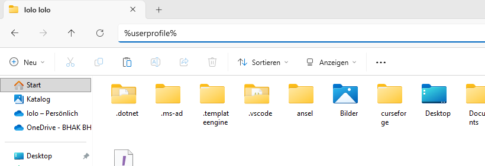
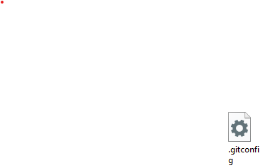
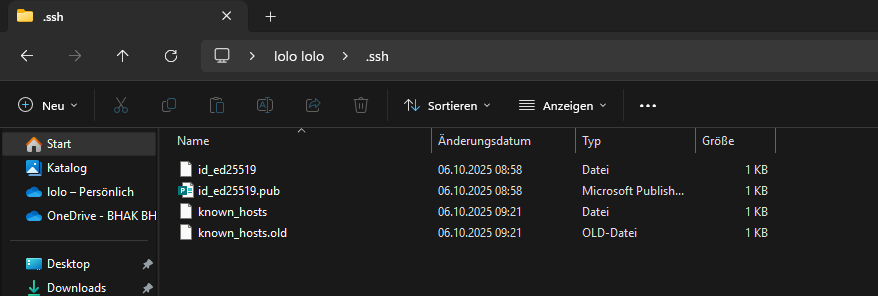
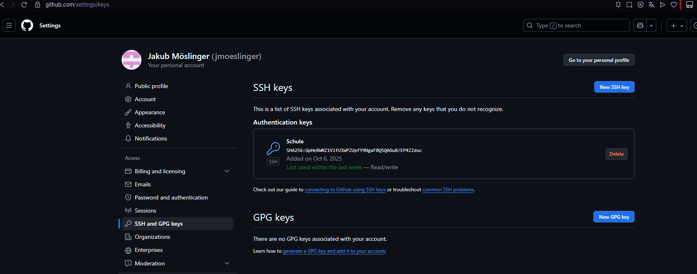
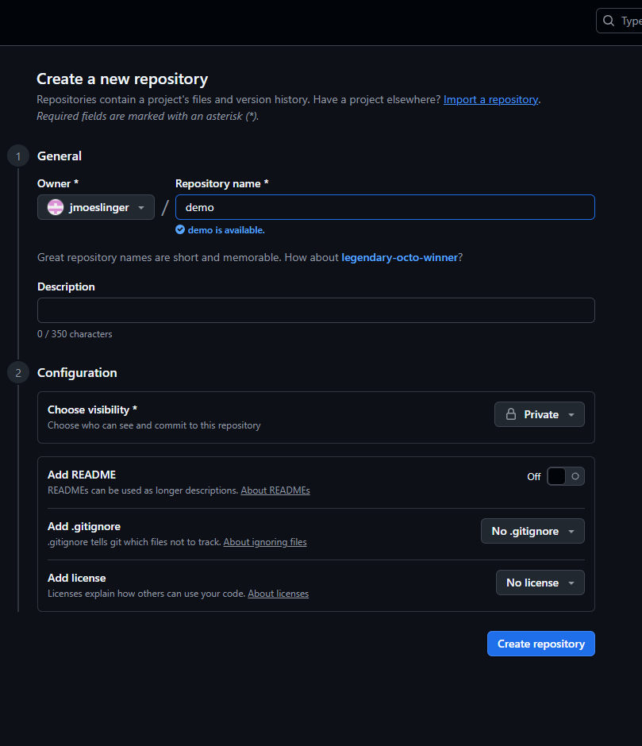
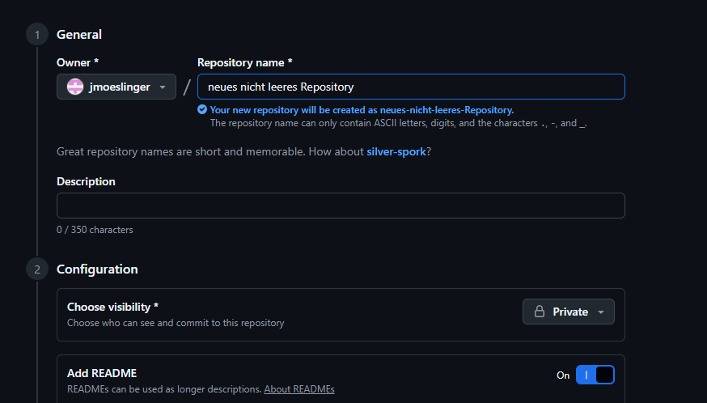
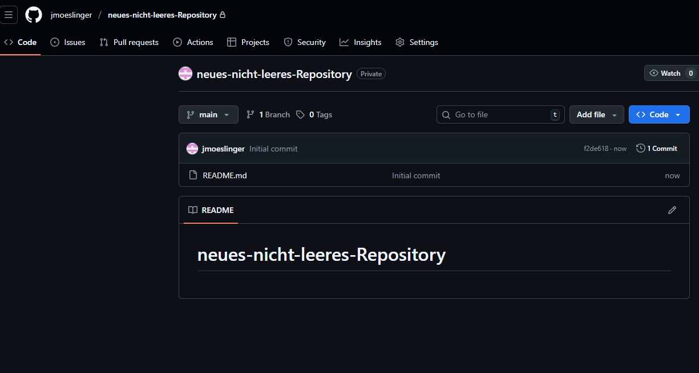
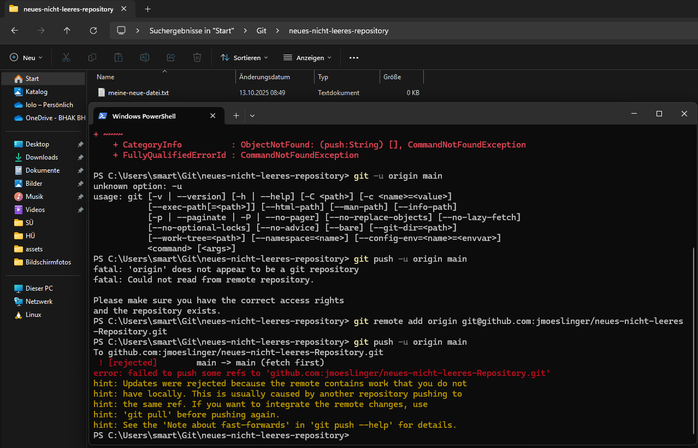

# Arbeit mit Git

## Konfiguration

Die Konfiguration wird bei der ersten Verwendung durchgeführt.
Anschließend gelten die Werte für alle neuen Projekte

In der Eingabeaufforderung werden folgende Befehlen ausgeführt:

```
git config --global user.name "Jakub Möslinger"
git config --global user.email "jmoeslinger@schueler.hakzell.at"
git config --global init.defaultBranch "main"
```

Da der Parameter `--global` verwendet wird,
können diese Befehle in einem neliebigen Verzeichnis ausgeführt werden

>**Hinweis:** Falls Git neu installiert wurde,
müssen sämtliche Eingabeaufforderungen (Fenster) vor der Befehlsausführung geschlossen werden.

Nach der Ausführung dieser Befehle befindet sich im Benutzerprofil (im Explorer `userrprofile`) eine datei names `.gitconfig` mit folgendem Inhalt:

[user]
	name = Jakub Möslinger
	email = jmoeslinger@schueler.hakzell.at
[init]
	defaultBranch = main





## Allgemeines

Ein Git-Repository unterscheidet grundsätzlih zwischen drei Bereichen:

- `working copy`
- `staging area`
- `local repository`


Im **working copy** befinden sich alle Dateien eines Verzeichnisses (zB README.md, Bilder, etc.).
Möchte man den Inhalt eines Ordners versionieren ("unter Git stellen"), so müssen die Dateien zur **staging area** hinzugefügt werden. Nach einem Commit werden die verwalteten Dateien in einem **repository** gespeichert.

## Laufende Arbeit mit Git

### Reposity erstellen

Ein Repository wird **ein einziges Mal** erstellt. Hierzu wechselt man in
den Ordner und führt dort
```
git init
```
aus.

**Hinweis:** Durch `git init` wird im Ordner ein *.git*-Verzeichnis erstellt. Eventuell ist das Verzeichnis nicht sichtbar (ausgeblendete Element in Windows zuvor einblenden.)

### Elemente hinzufügen

Datein und (nicht leere) Ordner werden folgendermaßen hinzugefügt:

```
gti add .
git commit -m "add file"
```

Mit `git add.` werden alle Veränderungen (zB neue Dateien, veränderte Datei, gelöschte Datei, etc.) in den Staging-Bereich gegeben. Mit `git commit`wird der Staging-Bereich ins Repository geschrieben (gesichert). Um Commits mit logischen (zusammengehörenden) Einheiten zu erstellen, können gezielt Dateien mittels `git add filename` zum Staging-Bereich hinzugefügt werden. Dadurch können "bessere" Comits erstellt werden. In den Anführungszeichen wird eine kurze Nachricht, die den Inhalt des Commits beschreibt festgelegt.

### Remote-Repository hinzufügen

Ein lokales Repository kann auf zB GitHub remote gespeichert werden. Hierzu ist eine Anmeldung (Authentifizierung) bei GitHub notwendig.

Die Anmeldung erfolgt mittels *SSH-Schlüssel*, welche folgendermaßen generiert werden:

```
ssh-keygen -t ed25519
```

Hierdurch wird ein **Schlüsselpaar** erstellt. Der private Schlüssel bleibt immer beim Ersteller - der öffentliche Schlüssel darf beliebig weitergegeben werden. Je nach Sicherheitsbedarf wird für den privaten Schlüssel ein Passwort vergeben.

Die Keys werden automatisch im Verzeichnis `C:\%userprofile%\.ssh` gespeichert.



Der **öffentliche Schlüssel** wird in GitHub im Bereich Settings hinzugefügt:




Anschließend kann ein "Repository" in GitHub mittels "New" erstellt werden. Da **lokal bereits ein Git-Repository erstellt wurde** muss das **Remote-Repository bei Gitthub leer** sein.

Bei den SSH- Schlüsseln handelt es sich um eine asymmetrische Verschlüsselung. Dies bedeutet, dass keine Schlüsselübertragung zur Verschlüsselung erfolgen muss(kein Passwort). 



Während der Programmierung werden fortlaufend commits erstellt.
Diese Commits werden mitteks `git push` hinaufgeladen, falls online Änderungen in der Zwischenzeit erfolgt sind, so werden diese mittels `git pull` heruntergeladen.
 ### Remote-Repository klonen

Um auf ein Remote-Repository zugreifen zu können, muss das Repository **öffentlich** sein bzw. muss man in den Einstellungen als Mitarbeitender hinzugefügt worden sein.

Nach einem Klick auf den "Clone-Button" wird die SSH-URL kopiert und in der Eingabbeaufforderung wird

```
git clone git@github.com:perasser/apr-2b.git
```
eingefügt. Dadurch wird das Remote-Repository heruntergeladen und in einem Ordner namens *apr-2b* gespeichert. Möchte man einen anderen Ordner namens *apr-2b* gespeichert. Möchte man einen anderen Ordnernamenen nutzen. Mittels den Command 
```
git clone git@github.com:perasser/apr-2b.git apr2-ordner
```

### Repository löschen

In GitHub können Repositorys im Settings-Bereich im Abschnitt "General" gelöscht werden.

**Hinweiß:** Fehlende Berechtigung können dazu führen, dass kein Settings-Bereich verfügbar ist.

### Mehrere Remote-Repositorys

Bei einem Repository können  mehrere Remote-Repositorys hinzugefügt werden. Standardgemäßig erhält man  ein Remote-Repository den Namen *origin*.

Das Remote-Repository wird mittels:

```
git remote add origin git@github.com:perasser/xyz.git
```
hinzugefügt. Ein Name (zB origin) darf nur ein einziges Mal verwendet werden. Möchte man ein zweites Remote-Repository hinzufügen, so können folgendermaßen schreiben:

```
git remote add classroom git@github.com:perasser/xyz.git
```
Bei `git push` muss ausgewählt werden, wohin die lokalen Commits übertragen werden.

```
git push origin main
```

bzw.
```
git push classroom main
```
 Ist nur ein Remote-Repository verbunden, so reicht die Angabe von `git push`(ohne Details). 
**Hinweis** Dei verbundenen Remote-Repositorys können
mittels `git remote -v` angezeigt werden.

### Dateien/Ordner ausschließen

Um Dateien bzw. Ordner vom Repository auszuschließen, wird eine Datei namens `.gitignore` im Repository gespeichert. In dieser Datei werden die einzele Einträge (Dateiname bzw. Ordnername) zeilenweise erstellt:

Um zu Beispiel einesn Ordner namens`.bin` vom Repository auszuschließen, wird eine `gitignore`-Datei mit folgendem Inhalt erstellt:

```
bin/
```
Um zusätzlich auch noch eine Datei namens `geheim.txt.` auszuschließen wird folgender Inhalt in die Datei geschrieben:

```
bin/
geheim.txt
```


 ## Achtung: Fehler

 Im folgenden Abschnitt wird gezeigt, welche Fehlermeldung erscheint, wenn ein Repository lokal und remote mit Inhalt erstellt wird:





Anschließend wird in einem Ordner ebenfalls eine Datei hinzugefügt, ein Commit erstellt und mit dem zuvor erstellten GitHub-Repository verbunden:



#### Exkurs: Public-Key-Verfahren


**Achtung:** Ein Repository darf NIEMALS lokal und remote (bei GitHub) erstellt werden!


Das Remote-Repository wird folgendermaßen hinzugefügt:

```
git remote add origin git@github.com:jmoeslinger/demo.git
git push -u origin main
```

Mittels `git push` werden stets die Commit zu GitHub übertrageb. Da der SSH-Schlüssel zu Anmeldung verwendet wird, musss auf die Auswahl SSH geachtet werden:


1. Der öffentliche Schlüssel diehnt zum Verschlüsseln - der private Schlüssel zur Entschlüsselung.
2. Mit dem privaten Schlüssel kann signiert werden - mit dem öffentlichen Schlüssel kann die Signatur überprüft werden.
3. Wird der Public-Key auf einen Server gespeichert/hinterlegt so kann eine Anmeldung auf diesen Server mit dem privaten Schlüssel erfolgen (ohne Passwort)