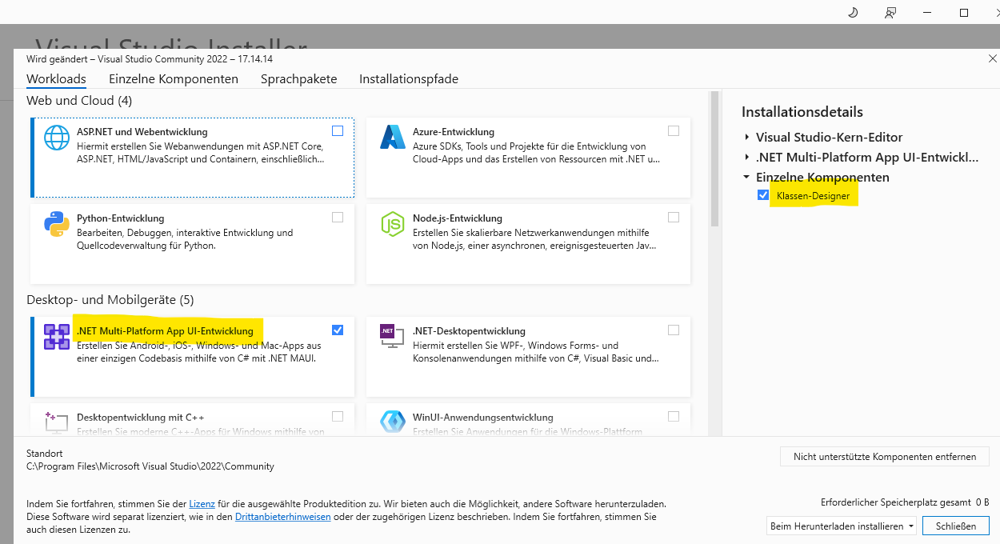
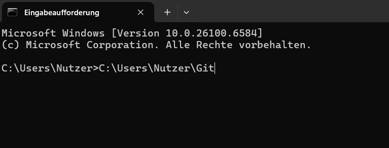
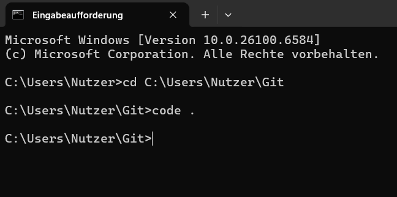
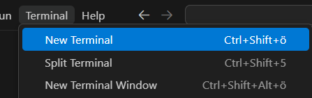
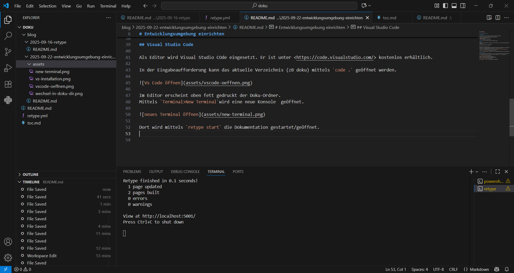

# Entwicklungsumgebung einrichten

## Visual Studio 

Visual Studio wird von <https://visualstudio.microsoft.com/de/> heruntergeladen.

Im Installer werden folgenden Workloads und Komponenten ausgewählt:

- .NET Multi Platform App UI-Entwicklung
- Klassen - Designer



>**Hinweis:** nach der Installation soll der PC neugestartet werden.

## Retype

retype wird als Dokumentations-Tool verwendet. Es wird die Installation lt. <https://retype.com/guides/installation/> durchegführt.

Der Code im Bereich **dotnet** wird ausgeführt:

```
dotnet tool install retypeapp --global
```

Anchließend wird im Benutzerverzeichnis ein Ordner namens Git erstellt und in diesem Ordner wird die Dokumentation (= Ordner "doku") erstellt. Die Dokumentation befindet sich zB unter `C:\Users\mmuster\Git\doku`.

Der Wechsel in der Eingabeaufforderung in den Doku-Ordner erfolgt mittels ` cd C:\Users\mmuster\Git\doku`.



>**Hinweis** Der Ordner doku kann vom Windows Explorer in die Eingabeaufforderung per Drag & Drop eingefügt werden.

## Visual Studio Code

Als Editor wird Visual Studio COde eingesetzt. Er ist unter <https://code.visualstudio.com/> kostenlos erhältlich.

In der Eingabeaufforderung kann das aktuelle Verzeichnis (zB doku) mittels `code .` geöffnet werden.



Im Editor erscheint oben fett gedruckt der Doku-Ordner.
Mittels `Terminal>New Terminal`wird eine neue Konsole  geöffnet.



Dort wird mittels `retype start` die Dokumentation gestartet/geöffnet.



Wenn die Dokumentation nicht automatisch gestartet wird, kann mittels `STRG` und einem KLICK auf die URL die Dokumentation manuell geöffnet werden.

## Git

Git wird zu verteilen Versionsverwaltung verwendet. Hierzu wird der Client von <https://git-scm.com/downloads/win> heruntergeladen und installiert.

Die Installation wird standardmäßig durchgeführt. Nur bei "override branch" wird **main** festgelegt.


