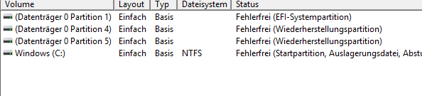
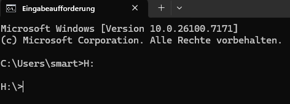
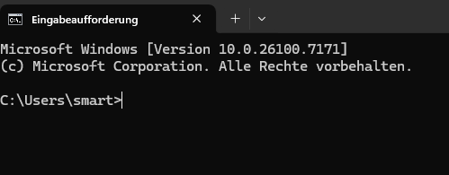

 # Dateisystem

## Windows

Windows unterteilt Festplatten in Partitionen.



Partitionen können einen Namen (Buchstaben) haben. Der Wechsel zwischen den Partitionen erfolgt folgenddermaßen:



Es wird also der Buchtstabe mit einem Doppelpunkt angegeben. Es kann zu allen Netzlaufwerken, Datenträger, Wechselmedien uetc. gewechselt werden.

In Windows ist`\`(Backslash) das Rootverzeichnis in einer Partition. Wird zB `H:\` angegeben, so bedetutet sies, dass man sich in der Partition bzw. beim Laufwerk H: im Stammverzeichnis befindet

Das Pfadtrennzeichen in Windows ist ebenfalls `\`. Ein Pfad zum eigenen Benutzerverzeichnis (=`Home` bzw. `Userdir`) sieht folgendermaßen aussehen:

```
C:\Users\smart
```

Beim öffnen einer Konsole wird standarnmäßig in diesen Ordner gewechselt:



### Relative und absolute Pfade

Bei einem relativen Pfad wird Stehts vom aktuellen Verzeichnis aus in ein anderes Verzeichnis gewechselt.

**Beispiel:** Nach dem Öffnen der CMD befindet man sich in `C:\Users\smart` und mit dem folgenden Befehl wird ausgehend vom`smart`-Verzeichnis in den Ordner `Git` gewechselt:

```
cd Git
```

Wird mit `cd \Users\smart\Git` in das Verzeichnis gewechselt, so bedeutet dies, daass ausgehend vom Rootverzeichnis in den Git-Ordner gewechselt wird - hierbei handelt es sich um einen absoluten Pfadangaben.